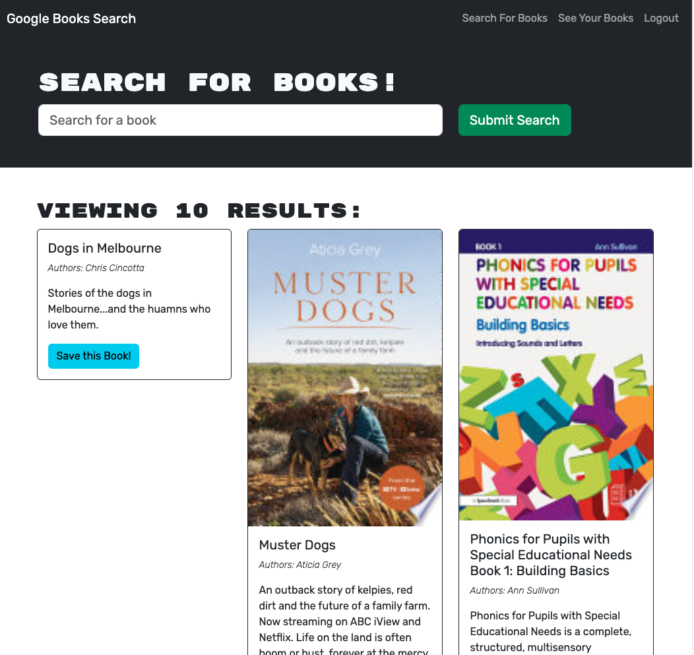

# Book Search Engine

## Description

This is a Google Books API search engine built with GraphQL APU and Apollo Server. It searches your favorite books with a brief information about them, and can have the option to save the books to your own personal books page.

## Table of Contents

- [Screenshots](#screenshots)
- [Installation Guide](#installation)
- [Usage](#usage)
- [Credits](#credits)
- [License](#license)

## Screenshots

**Search books page**


**Saved books page**


## Installation

- Install independencies

```bash
npm i
npm run install
```

- Run application

```bash
npm run develop
```

## Usage

- Search for books to read
- Get information about the book
- Have a collection of books in your own page when you sign up
- Option to delete books in your page

## Credits

The underlying technologies used in this Book Search Engine website is React, MongoDB, GraphQL with Apollo Server

- [React](https://legacy.reactjs.org/docs/getting-started.html)
- [GraphQL and Apollo](https://www.apollographql.com/tutorials/)

## License

This project is licensed under the MIT License.

## Link to Deployed Application

- [Render deployed application](https://book-search-engine-qmnh.onrender.com)
